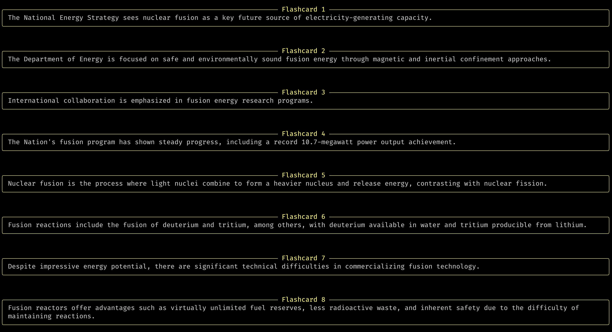

# Flashcard Generator

This app takes a PDF or text file and uses OpenAI's GPT model to create summarized flashcards in the output.

## Usage

```bash
echo 'API_KEY=[openai api key]' > secret.py

poetry install

poetry run python flashcards.py example.pdf
```

[](screenshot.png)
